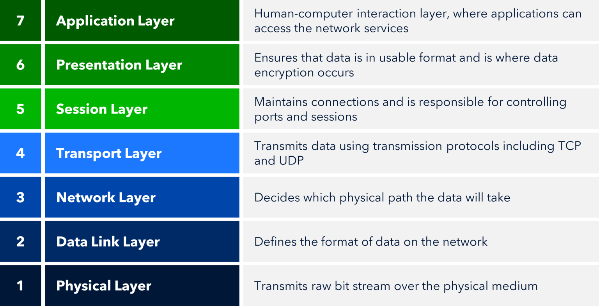

Nama: Bertrand Lianto
Nim: 103072400019
Kelas: IF-04-05
Modul: 9 (Web Server)

Pertama kita review ulang mengenai osi layer yaitu bagaimana jaringan bekerja  
step 1 yaitu data dikirimkan dalam bentuk bit (0/1) melalui media fisik  
step 2 yaitu pengaturan untuk mengirim antar device / jaringan lokal  
step 3 menentukan jalur pengantaran  
step 4 mengatur koneksi dan keandalan data  
step 5 mengatur sesi komunikasi  
step 6 mengatur format data  
step 7 layer yang berinteraksi langsung dengan client  

Web server adalah bagaimana cara kita memvisualisasikan sebuah data langsung kepada client melalui browser  
Sehingga web server termasuk pada osi layer nomor 7 

Selanjutnya kita langsung membuat sebuah file index.html dengan isian singkat untuk ditampilkan bila alamat web server diakses dengan sesuai  

Disini kita mempunyai sebuah skeleton code dari web server yang dapat kita kembangkan  

Setelah kita perbaiki skeleton code tadi kita dapat melihat codenya menjadi seperti ini, tujuan dari code ini mengupload file index.html ke website kita dengan port 6789 dan menampilkan 404 not found bila tidak berhasil, serta code ini hanya dapat menangani 1 klien saja   

Bila kita menggunakan thread yang memungkinkan multi klien dapat mengakses web server yang sama kita dapat menggunakan code ini, kedua code kurang lebih berjalan sama persis hanya saja berbeda di jumlah klien yang dapat ditangani  

Kita langsung run kedua codingan tersebut  

Hasilnya menampilkan 404 not found apabila ada kesalahan dalam server atau tidak index.html atau alamat server yang diakses tidak sesuai (bukan index.html)  

Ini yang akan muncul ketika codingan berjalan sesuai  
